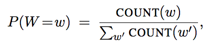
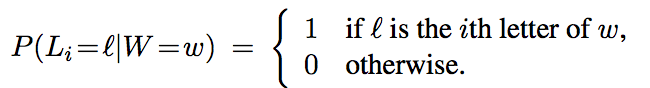
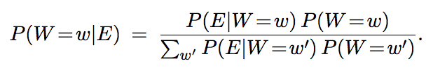
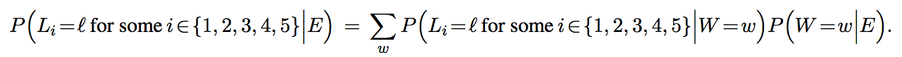
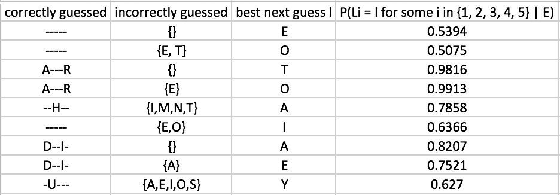

# Hangman
This is a python program that simulates a game. The game is as follows:

You are asked to guess the word w one letter at a time. The rules of this game
are as follows: after each letter (A through Z) that you guess, you’ll be told whether the letter appears in
the word and also where it appears. Given the evidence that you have at any stage in this game, the critical
question is what letter to guess next.

The program uses the following belief network:

Also, suppose that these five-letter
words are chosen at random from a large corpus of text according to their frequency:

where COUNT(w) denotes the number of times that w appears in the corpus and where the denominator is
a sum over all five-letter words. Note that in this model the conditional probability tables for the random
variables Li are particularly simple:

The posterior probability is:

Where E denote the evidence at some intermediate round of the
game: in general, some letters will have been guessed correctly and their places revealed in the word, while
other letters will have been guessed incorrectly and thus revealed to be absent.

The predictive probability, based on the evidence, that the letter l appears
somewhere in the word:

Below is a sample running output:

