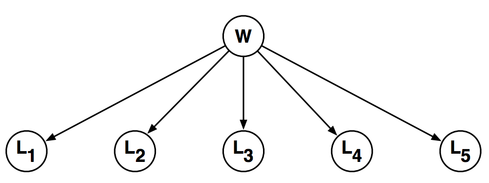

# Hangman
This is a python program that simulates a game. The game is as follows:

You are asked to guess the word w one letter at a time. The rules of this game
are as follows: after each letter (A through Z) that you guess, you’ll be told whether the letter appears in
the word and also where it appears. Given the evidence that you have at any stage in this game, the critical
question is what letter to guess next.

The program uses the following belief network:

